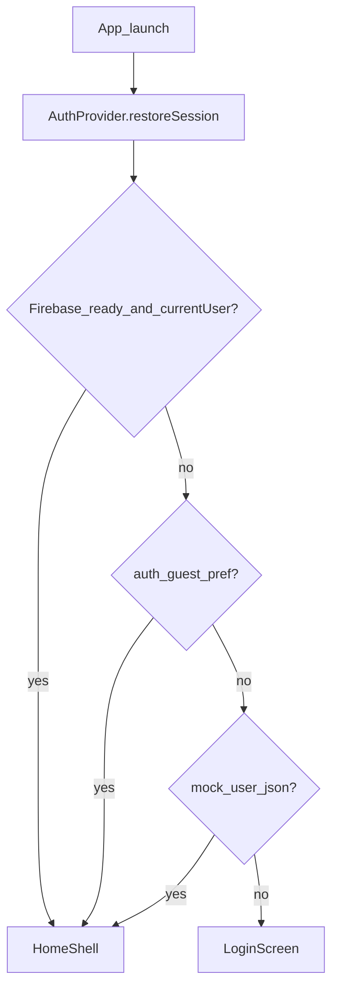

# 21Days Auth Design (v1)

Review document for account identity on the Flutter app, aligned with the
Cloud Run search backend in `21days-media-resources`.

## Goals

1. **Email as username** with a user-defined password
2. **Google Sign-In** (only social provider for now)
3. **Continue as guest** (local-only; no server identity)
4. Stay signed in across app restarts
5. In-app **Delete account** (App Store Guideline 5.1.1(v))

Profile-based app data and authenticated search APIs are **deferred**.

## Decisions

| Topic | Choice |
|-------|--------|
| Identity provider | Firebase Authentication (same stack as Google Cloud Identity Platform) |
| Email / password | Firebase Email/Password provider |
| Google | Firebase Google provider + `google_sign_in` |
| Guest | Local-only via `SharedPreferences` (not Firebase Anonymous Auth) |
| Profile DB | Not in v1 |
| Search / live APIs | Remain public (no Bearer token) |

## Data model (v1)

### Firebase Auth (registered users)

Source of truth for email and Google accounts:

- `uid` — stable user id
- `email` — username
- `providerData` — `password` and/or `google.com`
- password hash — stored only by Firebase (never in our DB)

### Local guest

Not a Firebase user:

```text
SharedPreferences
  auth_guest = true
```

App maps this to:

```text
UserModel(
  id: "guest_local",
  email: "",
  displayName: "Guest",
  authProvider: guest,
)
```

### Optional app profile (later)

When needed (preferences, mentor assignment, deletion audit):

```text
users/{uid}
  email
  display_name
  auth_providers
  is_guest          # false for registered; guests stay local-only
  created_at
  last_login_at
  deleted_at
```

Store in Firestore or Cloud SQL; never store passwords there.

## What we need from Google Cloud / Firebase

| Piece | Purpose |
|-------|---------|
| Firebase project (same GCP org as Cloud Run) | Auth console + keys |
| Email/Password provider enabled | Email login / signup |
| Google provider enabled | Google Sign-In |
| iOS app + `GoogleService-Info.plist` | Native Firebase config |
| Android app + `google-services.json` | Native Firebase config |
| OAuth client IDs (iOS / Android / Web as needed) | Google Sign-In |
| `flutterfire configure` → `lib/firebase_options.dart` | Dart options |

**Operator steps**

1. Create or link a Firebase project to the existing GCP project.
2. Enable **Authentication → Email/Password** and **Google**.
3. Register the iOS and Android apps with the correct bundle / application ids.
4. Download plist / json into the platform trees (or use FlutterFire CLI).
5. Run `dart pub global activate flutterfire_cli` then `flutterfire configure`.
6. Uncomment / rely on `Firebase.initializeApp` in `lib/main.dart` (already attempted at startup; falls back to mock if config is missing).

Until those files exist, the app uses a **mock** email/Google backend so UI and tests keep working, plus real **local guest** persistence.

## What we need from the Flask / Cloud Run backend (v1)

**Nothing required for login.** Firebase handles credentials and tokens.

Later (when profiles or private APIs exist):

- Verify `Authorization: Bearer <Firebase ID token>` on Cloud Run
- Optional `DELETE /api/me` to wipe server-side profile data during account deletion

Admin `X-Admin-Key` routes stay separate from end-user auth.

## Session persistence



- **Firebase users:** SDK persists to Keychain / EncryptedSharedPreferences; `currentUser` / `authStateChanges` restore the session and refresh ID tokens.
- **Guests:** `auth_guest` preference; cleared on sign-out or delete.
- **Mock users (dev):** JSON snapshot in preferences until Firebase is configured.

## Sign-in modes

1. **Email** — create account or sign in; email is the username.
2. **Google** — OAuth → Firebase credential.
3. **Guest** — no network; enter the app immediately; can sign out and create a real account later (no automatic linking in v1).

## Account deletion (App Store)

In-app path: **Account → Delete account** (confirm dialog).

| Mode | Behavior |
|------|----------|
| Guest | Clear local guest flag; return to login |
| Mock | Clear mock session prefs; return to login |
| Firebase | `FirebaseAuth.currentUser.delete()` (+ Google sign-out); may require recent login |

Also publish a privacy policy URL in App Store Connect describing deletion.

Sign-out alone is **not** sufficient for App Store review.

## Out of scope (v1)

- Firestore / SQL profile sync
- Firebase Anonymous Auth / guest upgrade linking
- Apple / Facebook / phone providers
- Protecting `/search` or `/api/live/sessions` with user tokens
- Backend `DELETE /api/me`

## App code map

| File | Role |
|------|------|
| `lib/services/auth_service.dart` | Email, Google, guest, restore, delete |
| `lib/services/firebase_bootstrap.dart` | Optional Firebase init |
| `lib/providers/auth_provider.dart` | UI state + restore |
| `lib/models/user_model.dart` | `email` / `google` / `guest` |
| `lib/views/auth/login_screen.dart` | Continue as guest |
| `lib/views/account/account_screen.dart` | Delete account |
| `lib/main.dart` | Bootstrap + AuthGate while restoring |
